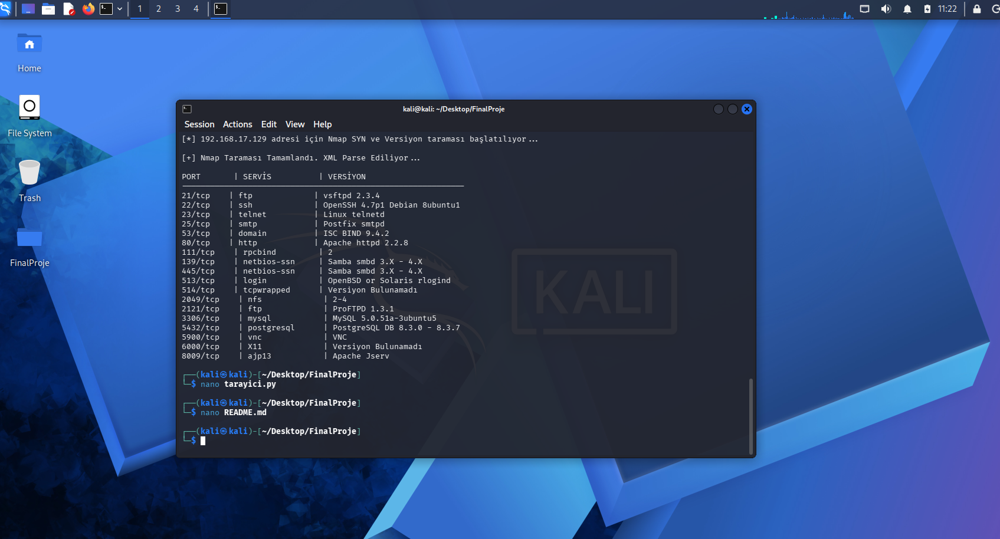

# hiraNurKocyigit_2521310045_TalibTasli_2521310039

1-) Github'da proje için repository oluşturuldu. İçerisine README.md,
 requirements.txt ve .gitignore dosyaları eklenip taslak oluşturuldu.

2-) Kali Linux ve Github, Linux da terminale yazdığımız şu adımlar ile
 birbirine bağlandı ve kali terminalinden commit-push edilmesi sağlandı:
  git add. , git commit -m "ne yazmak istenirse ", git push

3-) Proje klasörünün içerisine py uzantılı dosya oluşturuldu ve içine gerekli pyhton kodları yazıldı.
sudo python3 tarayici.py komutu ile dosya çalıştırıldı ve aşağıdaki görüntü elde edildi.

 
